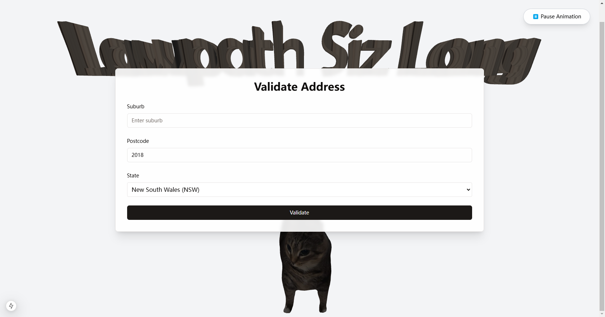
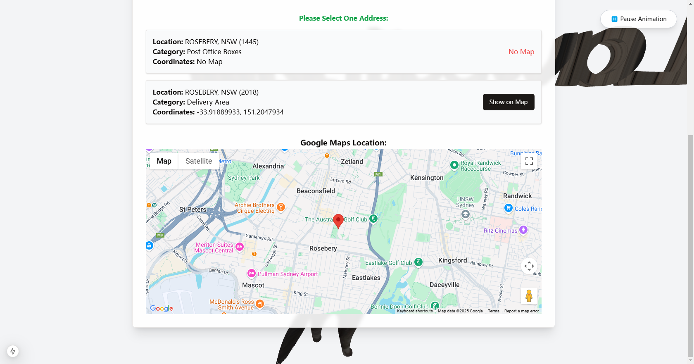
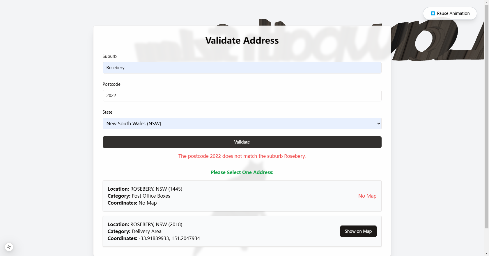

# Address Validation Form (Next.js + Apollo + shadcn/ui + Zod + Three.js)

This project provides an address validation form that verifies Australian addresses using a GraphQL proxy.

---

## 🚀 Getting Started

### 1️⃣ Install Dependencies
Ensure you have **Node.js 22** installed:
```bash
nvm install 22
npm install
```
### 2️⃣ Initialize UI Components

This project uses shadcn/ui, so initialize the UI components:
```bash
npx shadcn@latest init
npx shadcn@latest add button form input label
```
### 3️⃣ Run the Development Server
```bash
npm run dev
# or
yarn dev
# or
pnpm dev
# or
bun dev
```

Now, open http://localhost:3000 in your browser. You can start editing the page by modifying `pages/index.tsx`. The page auto-updates as you edit the file.
    
    If you feel animation is too noisy, you can click `Stop Animation` Button at right top to stop the animation.

### 4️⃣ Introduction to the Project

1. Initial Page

2. After Filling the Form, you can see multiple address for choosing.

3. After Choosing the Address, you can see the address on the map.(Thanks for Google Map API)

4. If it is not matched, you can see the error message.



## Folder Structure
```text
/app
   └─api
       └─graphql
               route.ts # graphql route
/components
   │  Form.tsx # form component
   │  GoogleMapComponent.tsx # google map component
   │  ThreeCanvas.tsx # three.js component
   │
   └─ui # shadcn ui
/lib
    apollo-client.ts # apollo client
    apollo-provider.tsx # apollo provider
    utils.ts # utils by shadcn
/public # some static files
```


## API Settings
To ensure the security of your API key and prevent it from being exposed in your codebase, it's essential to store it as an environment variable.
1. Rename `.env.template` to `.env`,
2. change the value of `API_KEY` to your own api key.


### ⚠️ Common Issues & Fixes

❌ Error: React functionality 'useContext' is not available

🔍 Cause: Apollo Client's useContext cannot run on Next.js Server Components.✅ Fix: Ensure ApolloProvider only runs in the browser.
```typescript jsx
"use client";
import { ApolloProvider } from "@apollo/client";
import { client } from "@/lib/apollo-client";

export default function MyApp({ children }) {
    return <ApolloProvider client={client}>{children}</ApolloProvider>;
}
```

### 📌 Improvements
1. Optimize the animation system. Now every frame is rendered. You can use the principle of human visual retention to reduce the number of frames or use interpolation to reduce memory consumption.
2. Add more error handling, such as network error handling.
3. 